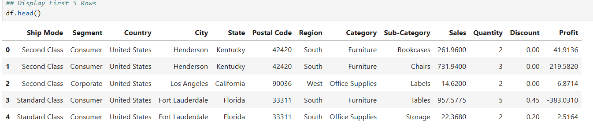
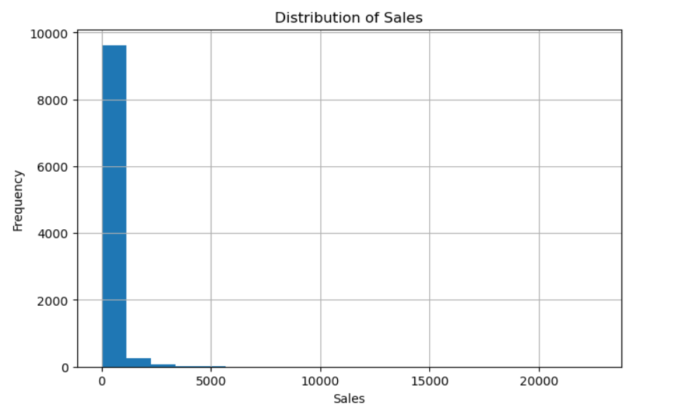
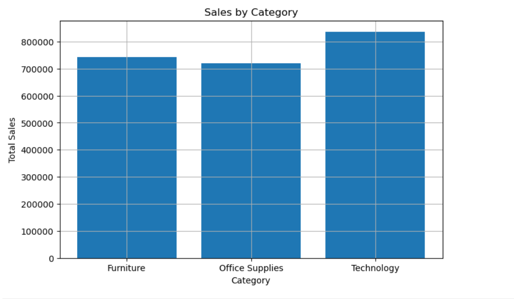
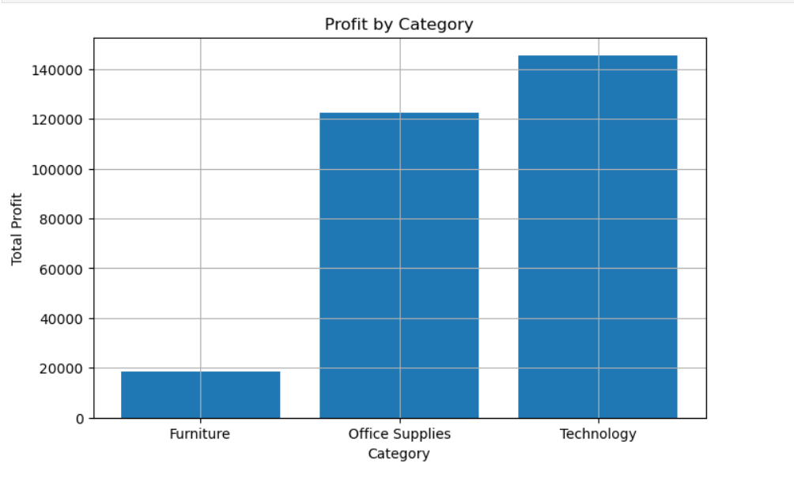
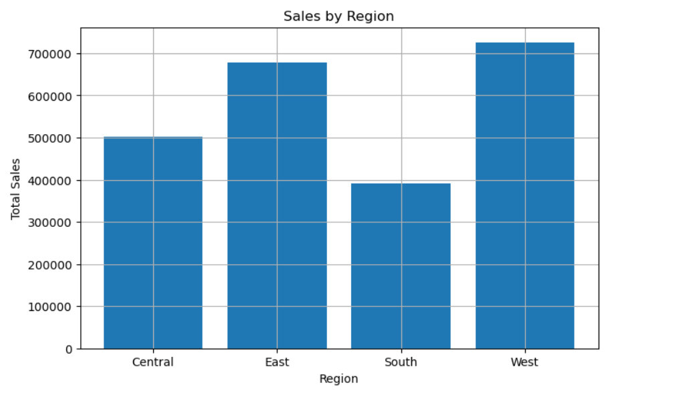
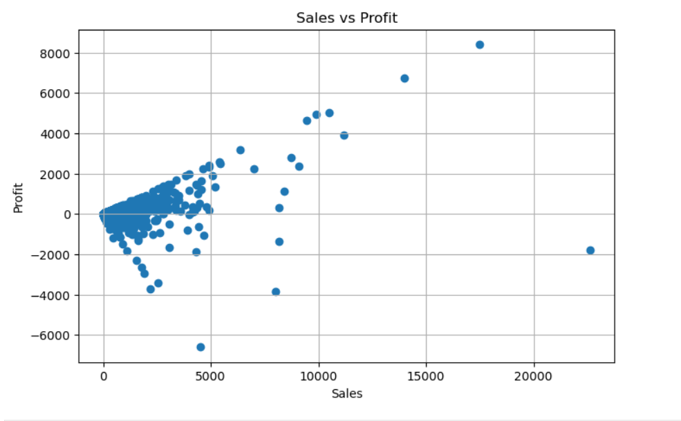

# 📸 Sales Data Cleaning & EDA - Project Screenshots

This folder contains the screenshots of the data cleaning process and exploratory data analysis (EDA) performed using Python, Pandas, Matplotlib, and Seaborn.

---

## 1. Dataset Preview

Shows the first few rows of the Superstore dataset before analysis.

---

## 2. Sales Distribution

Displays the distribution of Sales values.

---

## 3. Sales by Category

Comparison of total sales across different product categories.

---

## 4. Profit by Category

Shows the profit generated by each category.

---

## 5. Sales by Region

Visualizes sales performance across different regions.

---

## 6. Sales vs Profit

Scatter plot showing the relationship between Sales and Profit.

---
⭐ These screenshots represent the final output of the Sales Data Cleaning and Exploratory Data Analysis project.
